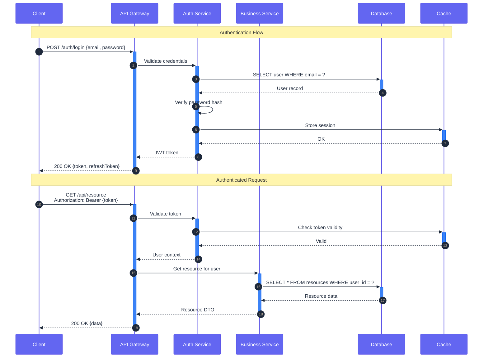
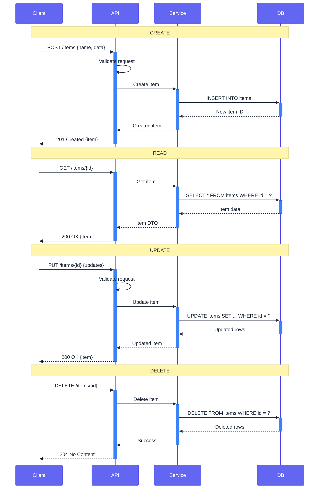
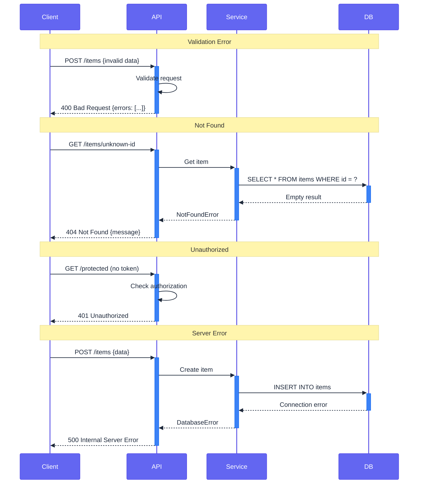
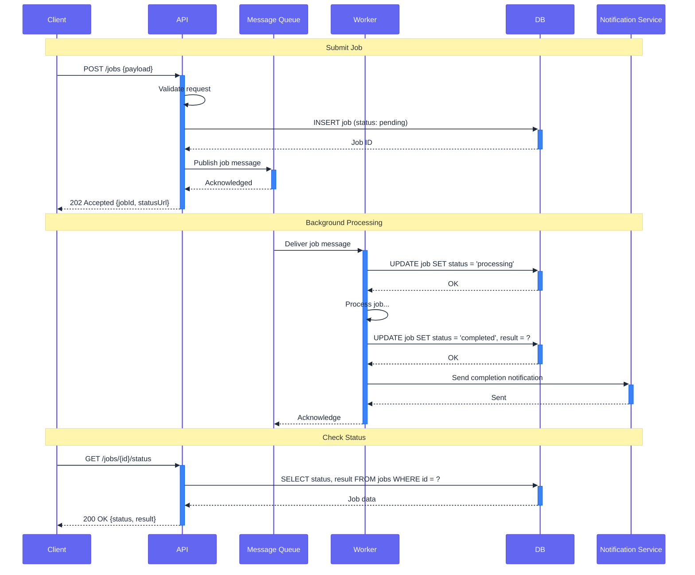
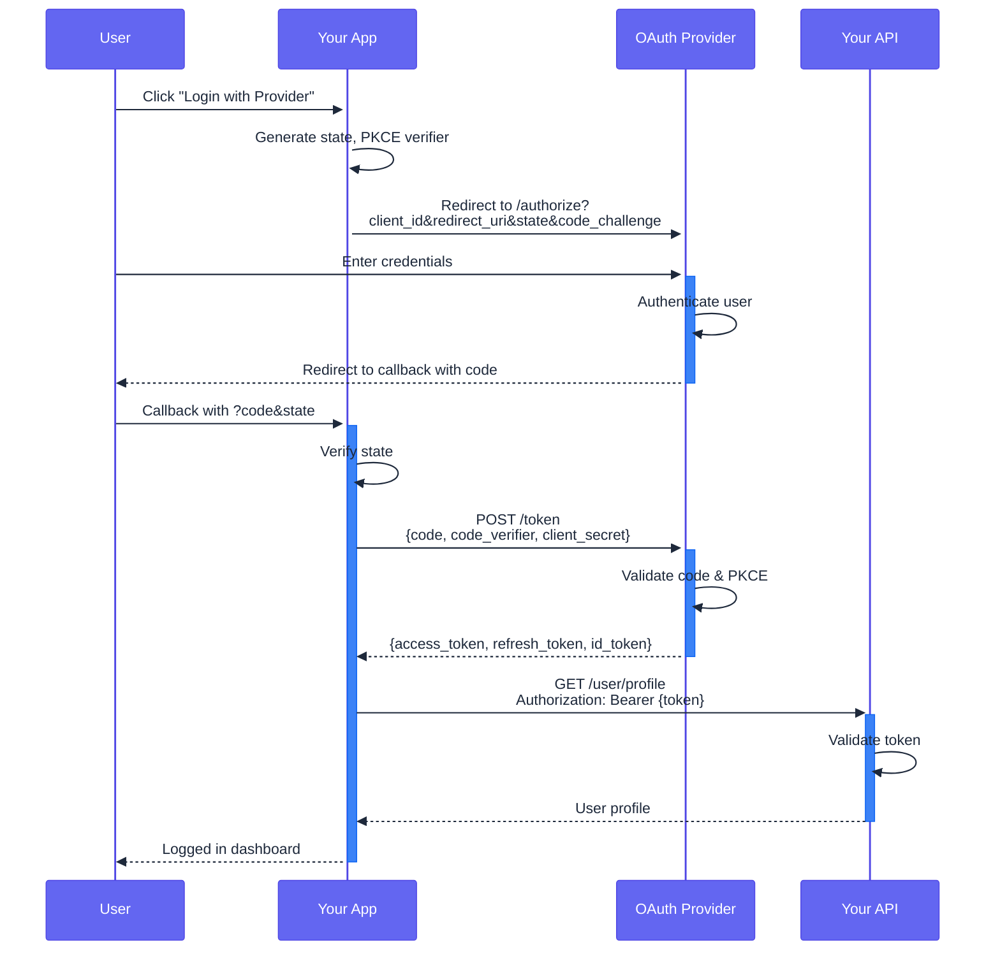

# API Flow Template

Ready-to-use sequence diagrams for documenting API interactions.

## REST API Flow

## CRUD Operations

## Error Handling

## Async Processing

## OAuth2 Flow

## Usage Instructions

1. Copy the relevant flow template
2. Rename participants to match your system
3. Adjust endpoints and payloads
4. Add/remove steps as needed
5. Include `accTitle` and `accDescr` for accessibility
6. Test in [Mermaid Live Editor](https://mermaid.live/)

## Tips

- Use `autonumber` to add step numbers
- Use `+/-` for activation (lifeline highlighting)
- Use `Note over` for section headers
- Use `alt/else`, `par/and`, `critical/option` for branching (see cross-portal-flow.md)
- Group related calls with blank lines
- Always include the Firefly theme init block
