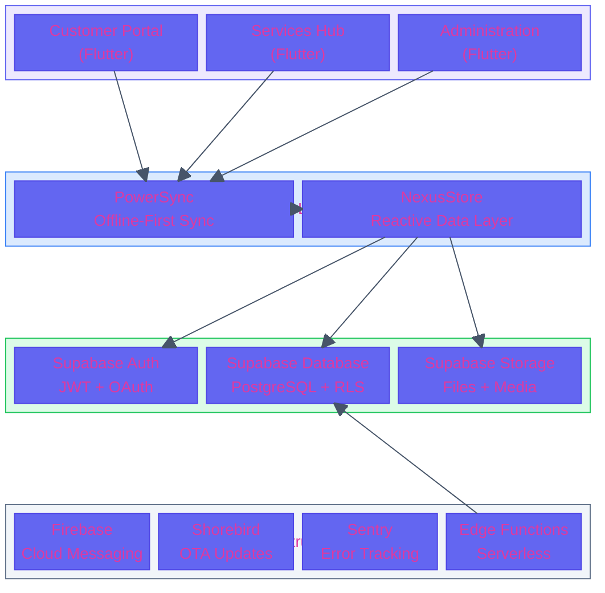
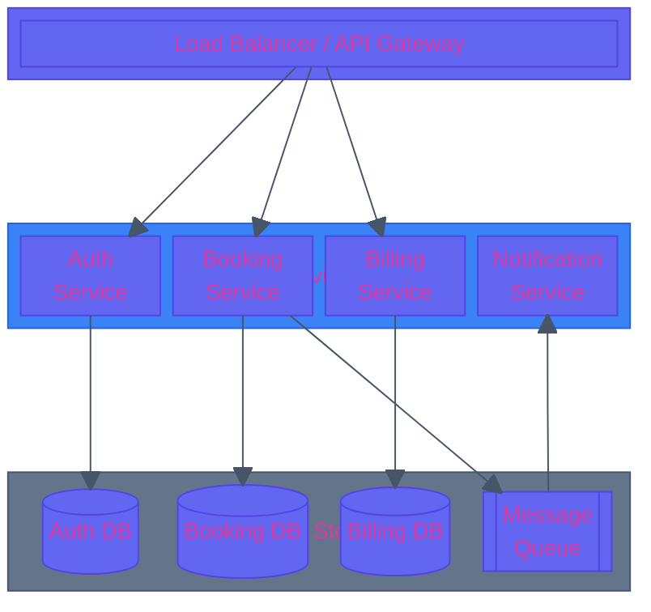
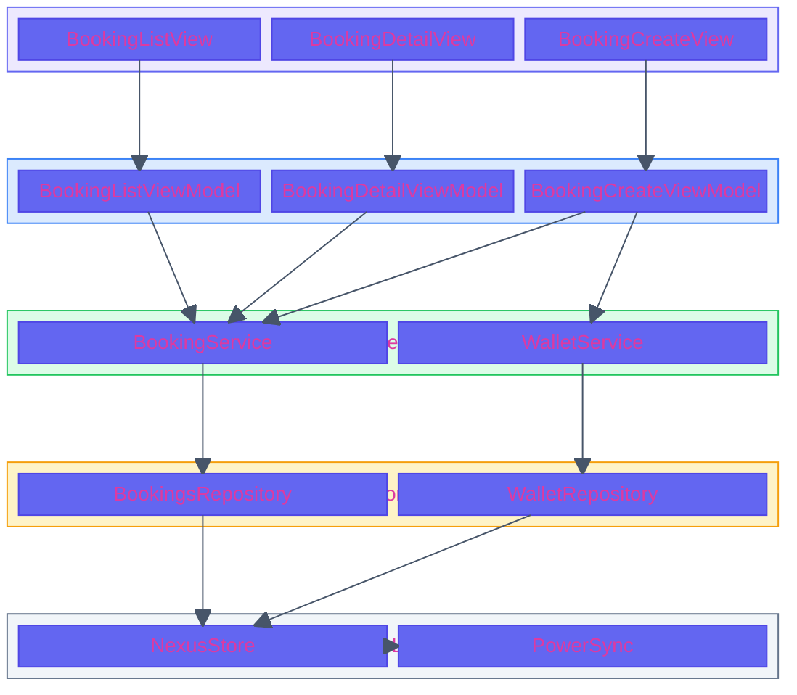
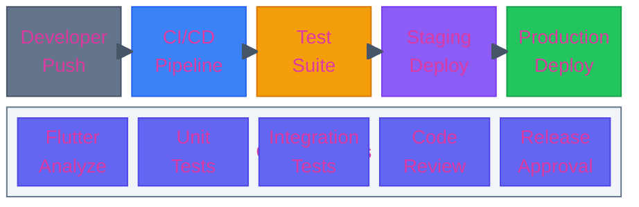

# Block Architecture Template

Ready-to-use block diagrams for grid-based system layouts and infrastructure visualization.

## Firefly System Architecture

## Microservices Layout

## Stacked MVVM Layer Diagram

## Deployment Pipeline

## Usage Instructions

1. Copy the relevant block architecture template
2. Adjust `columns N` for your layout needs
3. Update block labels and nesting
4. Add connections with `-->` arrows
5. Apply portal-colored styles to blocks
6. Test in [Mermaid Live Editor](https://mermaid.live/)

## Block Diagram Syntax Reference

| Feature | Syntax | Example |
|---------|--------|---------|
| Columns | `columns N` | `columns 3` |
| Block | `id["Label"]` | `auth["Auth Service"]` |
| Block group | `block:id["Label"]:span` | `block:svc["Services"]:3` |
| Database | `id[("Label")]` | `db[("PostgreSQL")]` |
| Queue | `id[["Label"]]` | `q[["Message Queue"]]` |
| Space | `space` or `space:N` | `space:3` |
| Arrow | `a --> b` | `app --> api` |
| Style | `style id fill:...,stroke:...` | See examples above |

## Tips

- Use `columns N` at the top to set the grid width
- Blocks can span multiple columns with `:N` suffix
- Use `space` or `space:N` for visual spacing between rows
- Nest blocks with `block:id["Label"]:span ... end`
- Style blocks using Firefly portal colors for consistency
- Block diagrams are ideal for layered architectures and infrastructure overviews
- For flow/sequence, use flowchart or sequenceDiagram instead
