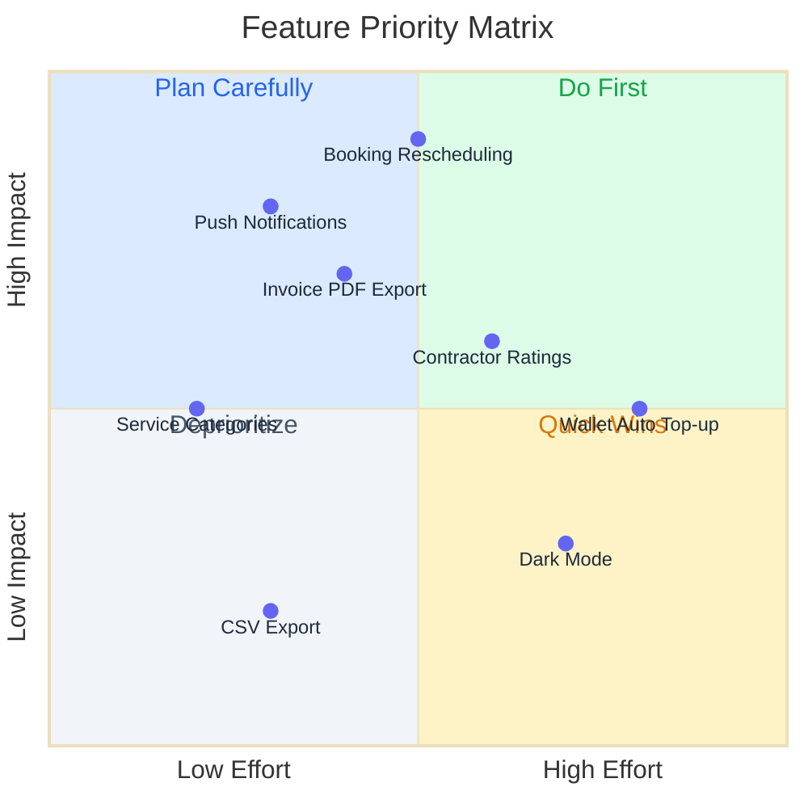
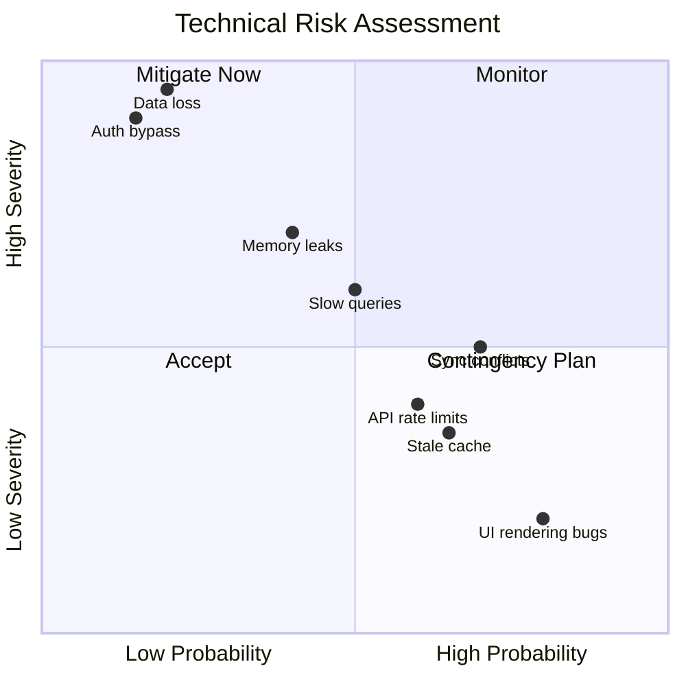
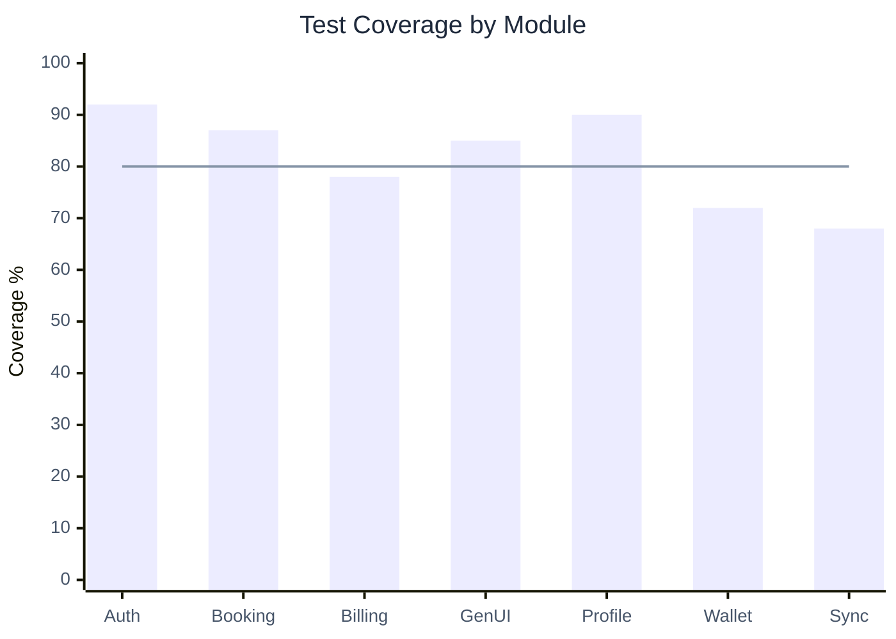
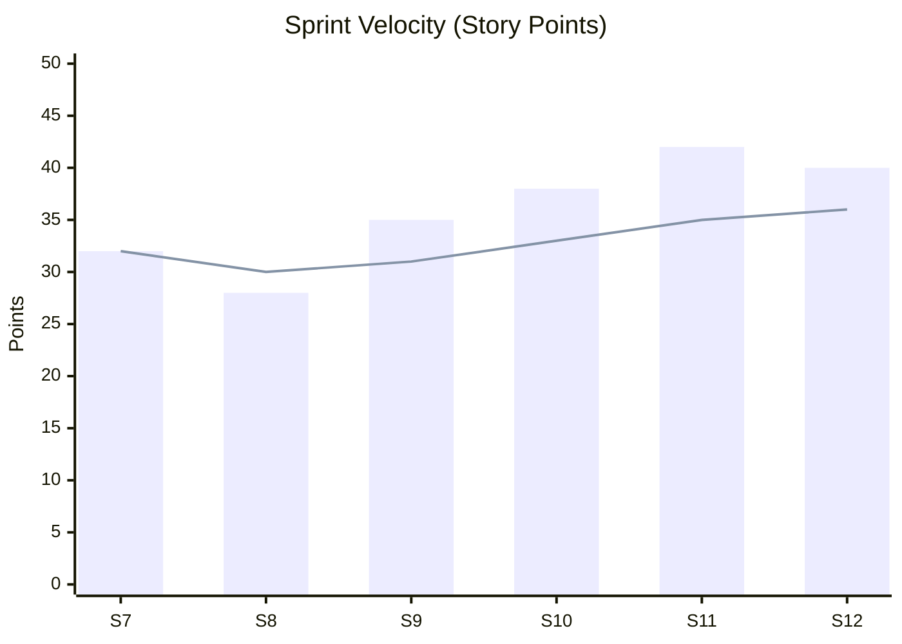
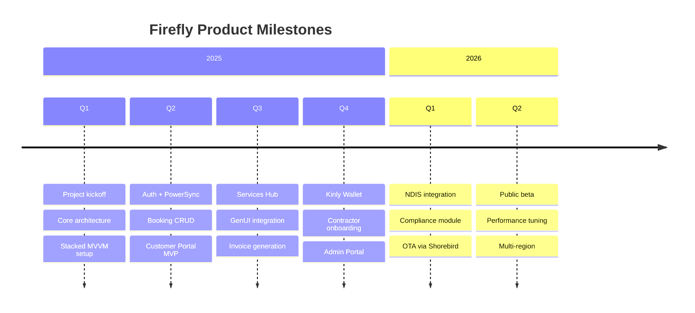
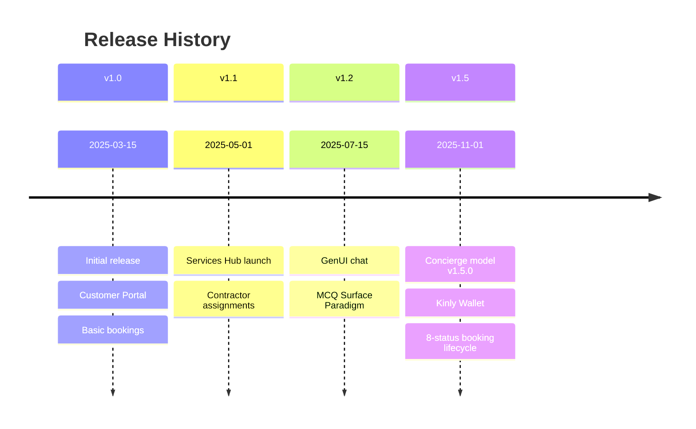
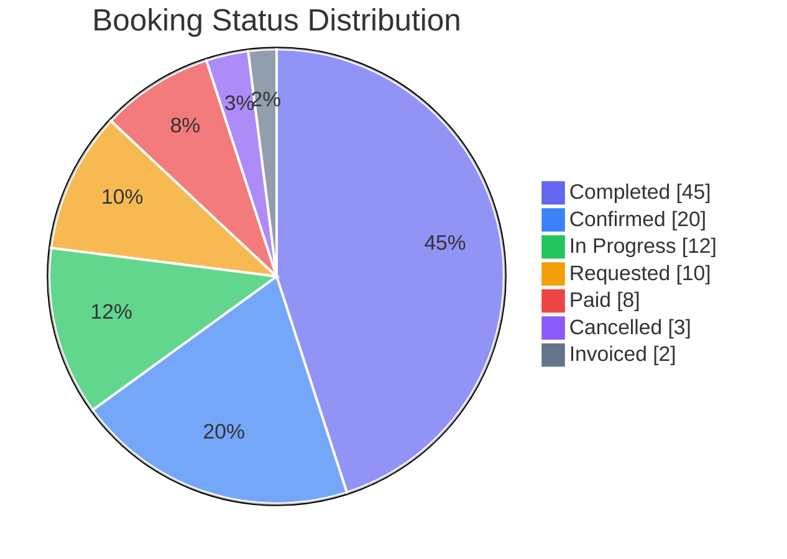
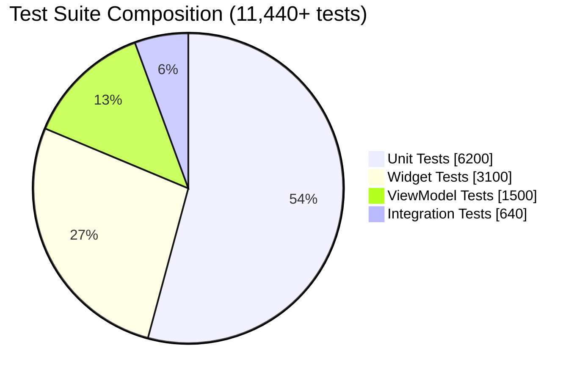

# Data Visualization Template

Ready-to-use chart and visualization diagrams for metrics, priorities, timelines, and distributions.

## Quadrant Chart (Priority Matrix)

## Quadrant Chart (Risk Assessment)

## XY Chart (Bar + Line)

## XY Chart (Sprint Velocity)

## Timeline (Chronological Events)

## Timeline (Release History)

## Pie Chart (Distribution)

## Pie Chart (Test Distribution)

## Usage Instructions

1. Copy the relevant visualization template
2. Update data points, labels, and titles
3. Adjust axis ranges and quadrant labels as needed
4. Test in [Mermaid Live Editor](https://mermaid.live/)

## Chart Type Selection

| Chart Type | Best For | Axes |
|------------|----------|------|
| `quadrantChart` | Priority/risk matrices, 2D comparisons | 2 labeled axes, 4 named quadrants |
| `xychart-beta` | Trends, comparisons, velocity | Named x categories, numeric y |
| `timeline` | Chronological events, release history | Time sections + events |
| `pie` | Distribution, composition | Category + value |

## Syntax Reference

### Quadrant Chart
| Feature | Syntax |
|---------|--------|
| Point | `Label: [x, y]` where x,y are 0-1 |
| Quadrant names | `quadrant-1` through `quadrant-4` |
| Axes | `x-axis Low --> High` |

### XY Chart
| Feature | Syntax |
|---------|--------|
| Categories | `x-axis ["A", "B", "C"]` |
| Range | `y-axis "Label" 0 --> 100` |
| Bar series | `bar [10, 20, 30]` |
| Line series | `line [15, 15, 15]` |

### Timeline
| Feature | Syntax |
|---------|--------|
| Section | `section Name` |
| Event | `Date : Event description` |
| Multi-line | `Date : Event 1` newline `: Event 2` |

### Pie
| Feature | Syntax |
|---------|--------|
| Slice | `"Label" : value` |
| Show values | `pie showData` |

## Tips

- Quadrant charts: coordinates are 0.0 to 1.0 on both axes
- XY charts: bar and line series must have same number of values as x-axis categories
- Timeline: use sections for grouping, indent events under dates
- Pie: values are proportional, not percentages — Mermaid calculates %
- Pie and timeline do NOT support theme init blocks in some renderers
- Use `showData` on pie charts to display numeric values
