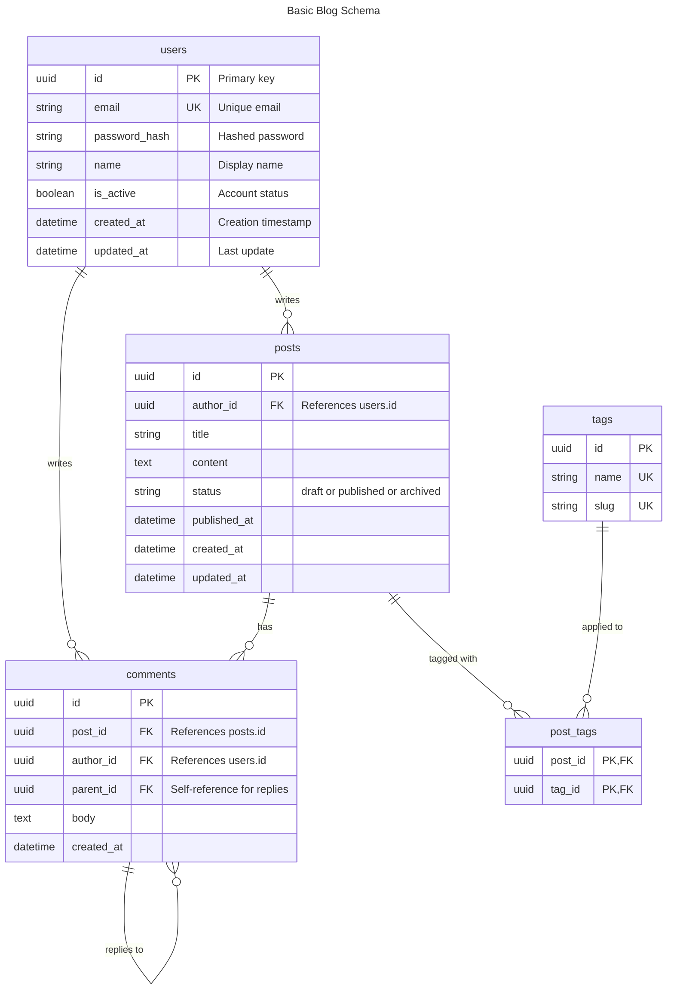
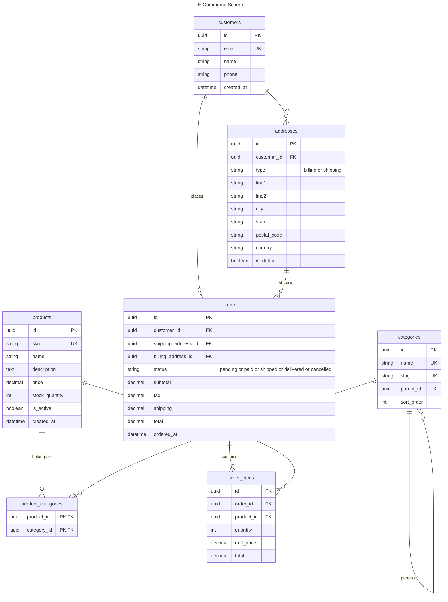
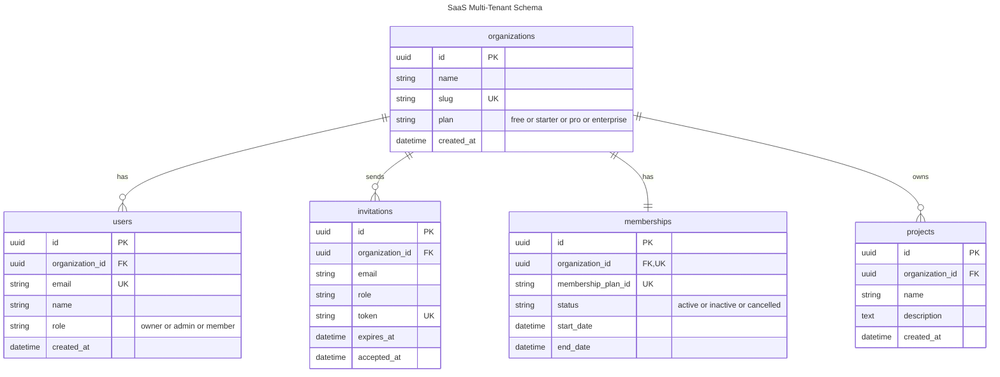
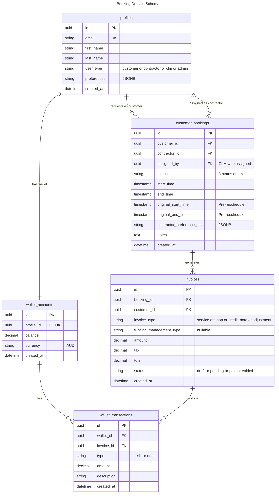

# Database Schema Template

Ready-to-use ER diagrams for documenting database schemas.

## Basic Schema

## E-Commerce Schema

## SaaS Multi-Tenant Schema

## Booking Domain Schema

## Usage Instructions

1. Copy the relevant schema template
2. Replace entities with your domain objects
3. Add/remove columns as needed
4. Define relationships using cardinality notation
5. Test in [Mermaid Live Editor](https://mermaid.live/)

## Cardinality Reference

| Notation | Meaning |
|----------|---------|
| `\|\|--\|\|` | One to one |
| `\|\|--o{` | One to many (optional) |
| `\|\|--\|{` | One to many (required) |
| `}o--o{` | Many to many |

## Column Type Annotations

| Annotation | Meaning |
|------------|---------|
| `PK` | Primary key |
| `FK` | Foreign key |
| `UK` | Unique constraint |
| `PK, FK` | Multiple constraints (comma-separated) |

## Tips

- Use `PK` for primary keys, `FK` for foreign keys, `UK` for unique
- Multiple constraints on one column: use commas (`PK, FK` not `PK FK`)
- Add comments in quotes for column descriptions — no double quotes inside
- Use `or` instead of commas in comment strings to avoid parser issues
- Keep entity names in lowercase snake_case
- Group related entities with `%%` comments
- Use JSONB for array columns synced via PowerSync (NOT TEXT[])
- ER diagrams support YAML frontmatter for titles but NOT `accTitle`/`accDescr`
