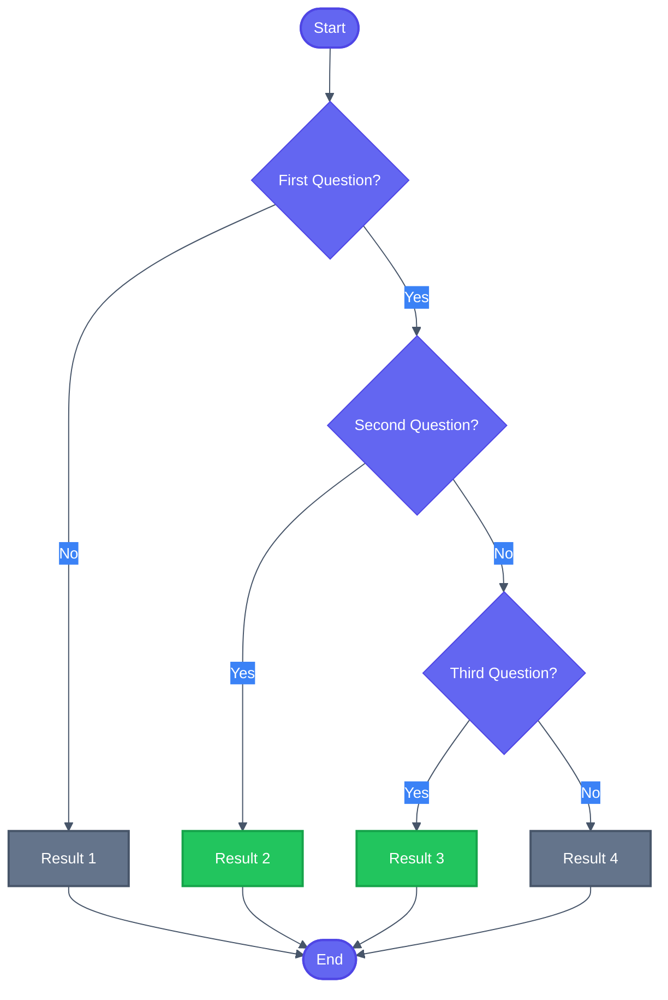
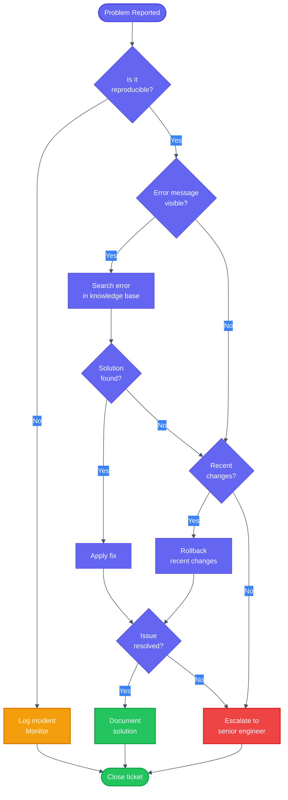
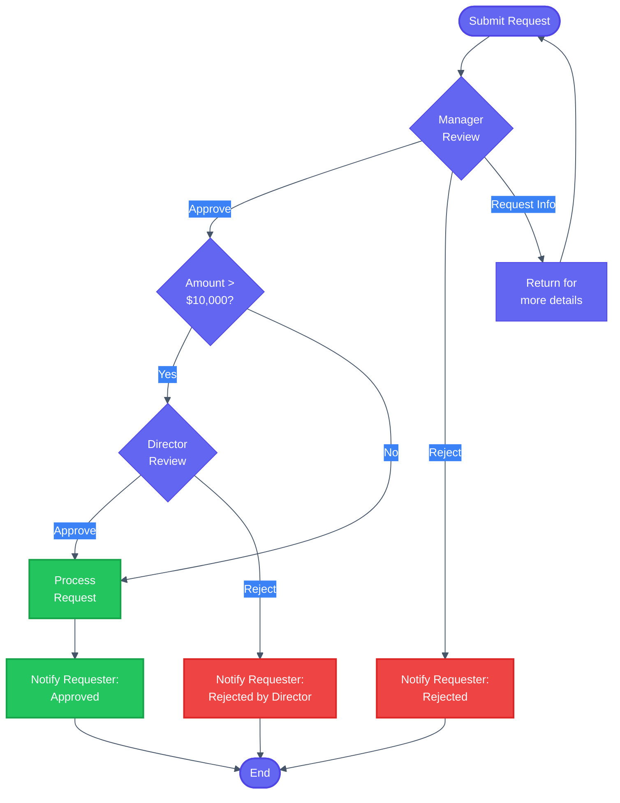
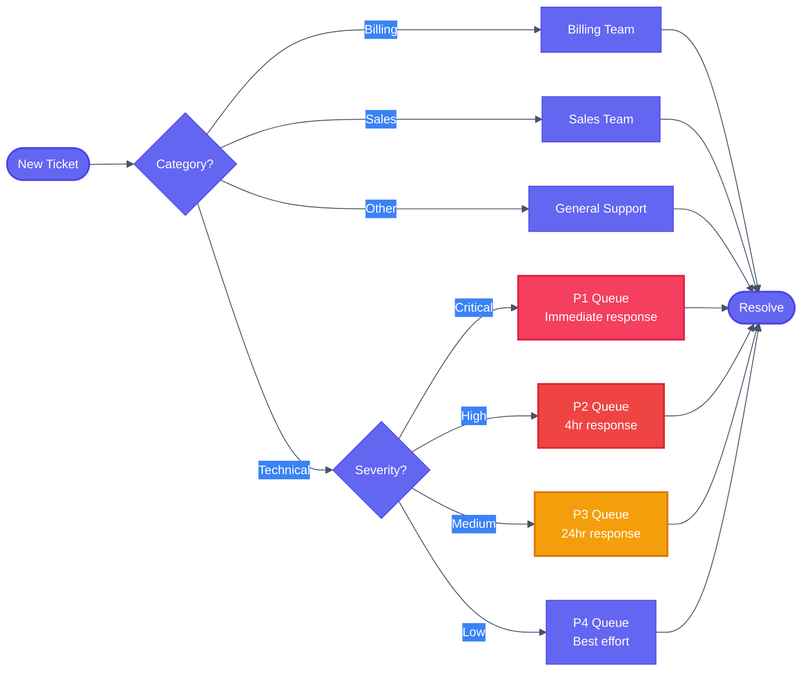
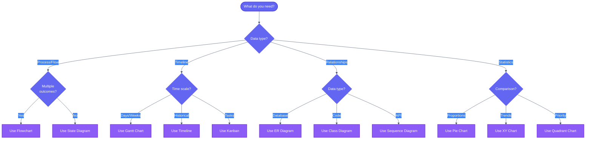
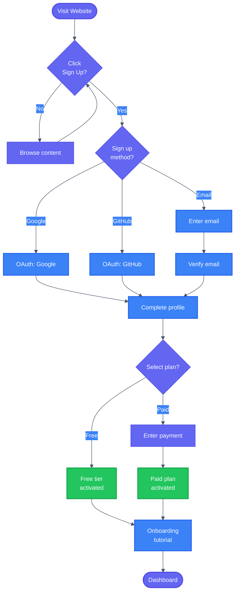
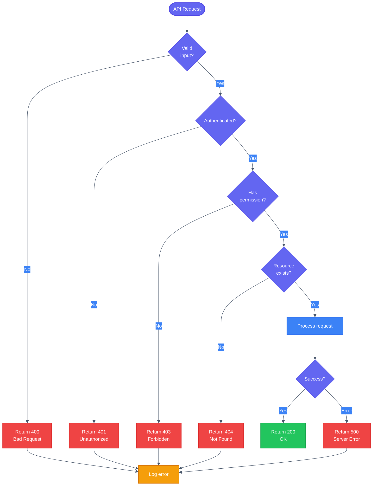
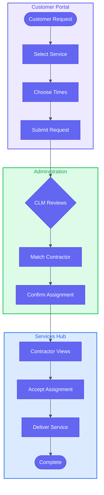

# Decision Tree Template

Ready-to-use flowcharts for documenting decision logic and workflows.

## Basic Decision Tree



## Troubleshooting Flowchart



## Approval Workflow



## Customer Support Routing



## Feature Selection Guide



## User Onboarding Flow



## Error Handling Logic



## Flowchart with Subgraphs (Cross-Portal)



## Usage Instructions

1. Copy the relevant template
2. Update question/decision nodes with your logic
3. Rename result/action nodes
4. Adjust flow direction (`TD`, `LR`, `TB`, `RL`)
5. Add `classDef` classes from the 8-class palette
6. Include `accTitle` and `accDescr` for accessibility
7. Test in [Mermaid Live Editor](https://mermaid.live/)

## Node Shapes

| Shape | Syntax | Use |
|-------|--------|-----|
| Rectangle | `[Text]` | Process/Action |
| Rounded | `([Text])` | Start/End |
| Diamond | `{Text}` | Decision |
| Stadium | `([Text])` | Terminal |
| Cylinder | `[(Text)]` | Database |
| Hexagon | `{{Text}}` | Preparation |
| Parallelogram | `[/Text/]` | Input/Output |
| Trapezoid | `[/Text\]` | Manual operation |
| Double circle | `(((Text)))` | Event |

## 8-Class Color Palette

```
classDef start fill:#6366f1,stroke:#4f46e5,color:#fff,stroke-width:2px
classDef process fill:#3b82f6,stroke:#2563eb,color:#fff,stroke-width:2px
classDef success fill:#22c55e,stroke:#16a34a,color:#fff,stroke-width:2px
classDef warning fill:#f59e0b,stroke:#d97706,color:#fff,stroke-width:2px
classDef error fill:#ef4444,stroke:#dc2626,color:#fff,stroke-width:2px
classDef info fill:#8b5cf6,stroke:#7c3aed,color:#fff,stroke-width:2px
classDef neutral fill:#64748b,stroke:#475569,color:#fff,stroke-width:2px
classDef critical fill:#f43f5e,stroke:#e11d48,color:#fff,stroke-width:2px
```

## Tips

- Keep decision questions short (use `<br/>` for line breaks)
- Every diamond MUST have labeled YES/NO edges (per style guide)
- Use the 8-class palette for consistent color-coding
- Add subgraphs with portal colors for cross-portal flows
- Use consistent naming for similar outcomes
- Test all paths through the diagram
