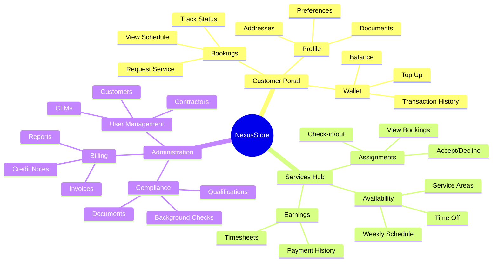
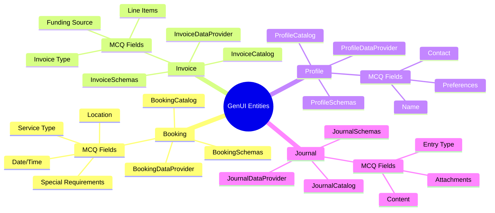
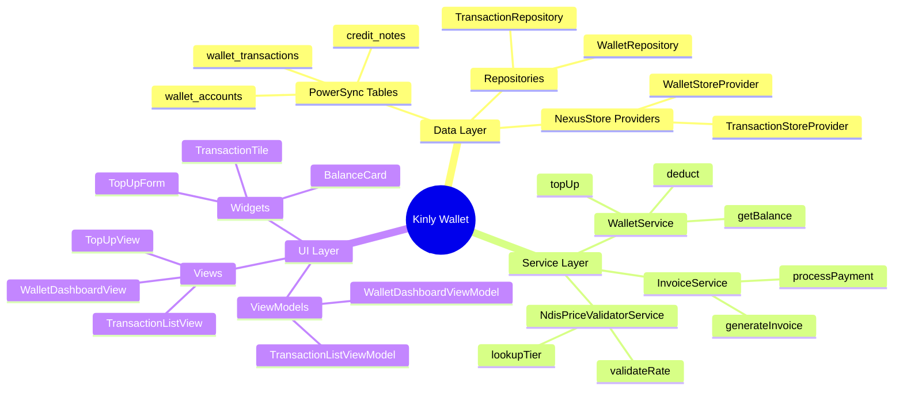
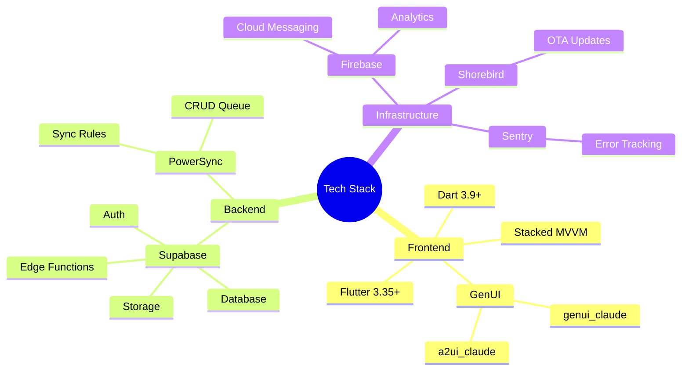
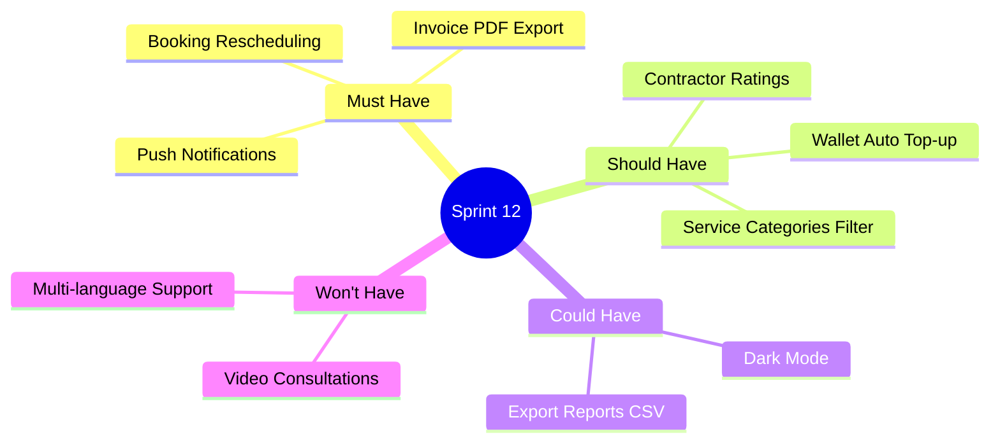

# Mindmap Template

Ready-to-use mindmaps for documenting feature coverage, system structure, and concept hierarchies.

## Portal Structure

## GenUI Entity Provider Coverage

## Feature Dependency Map

## Technology Stack

## Sprint Feature Breakdown

## Usage Instructions

1. Copy the relevant mindmap template
2. Update the root node with your topic
3. Modify branches using indentation (spaces, not tabs)
4. Test in [Mermaid Live Editor](https://mermaid.live/)

## Mindmap Syntax Reference

| Feature | Syntax | Example |
|---------|--------|---------|
| Root (rounded) | `root((Text))` | `root((System))` |
| Root (square) | `root[Text]` | `root[Features]` |
| Root (bang) | `root)Text(` | `root)Ideas(` |
| Branch | Indented text | `    Branch Name` |
| Sub-branch | Deeper indent | `        Sub Item` |
| Icons | `::icon(fa fa-name)` | `::icon(fa fa-book)` |

## Node Shapes

| Shape | Syntax | Visual |
|-------|--------|--------|
| Default | `Text` | Rounded rectangle |
| Square | `[Text]` | Rectangle |
| Rounded | `(Text)` | Rounded |
| Circle | `((Text))` | Circle |
| Bang | `)Text(` | Burst shape |
| Cloud | `)Text(` | Cloud shape |
| Hexagon | `{{Text}}` | Hexagon |

## Tips

- Mindmaps do NOT support theme init blocks — styling is automatic
- Use indentation (2+ spaces) to create hierarchy — tabs may not work
- Keep labels short — long text wraps poorly in mindmap nodes
- Limit depth to 4 levels for readability
- Use for brainstorming, feature maps, and structural overviews
- Not suitable for showing flow/sequence — use flowchart or sequence diagrams instead
