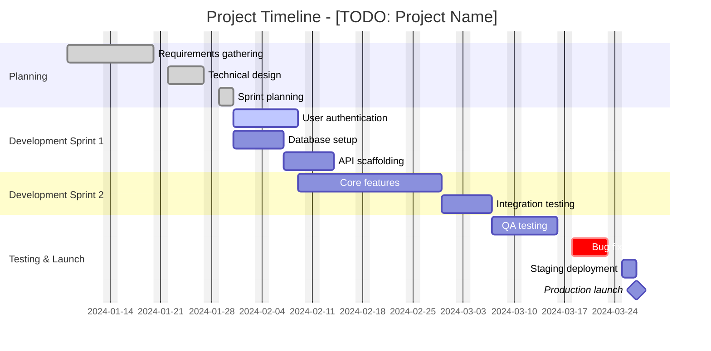
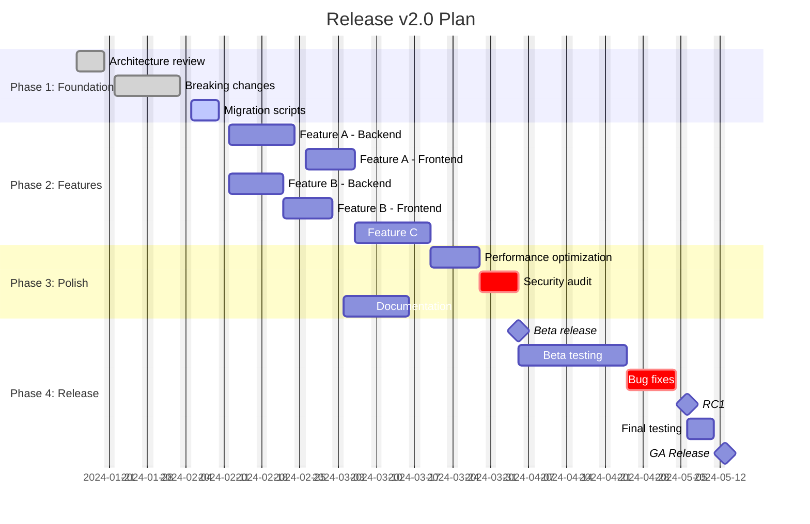
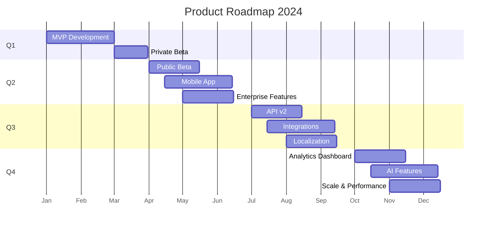
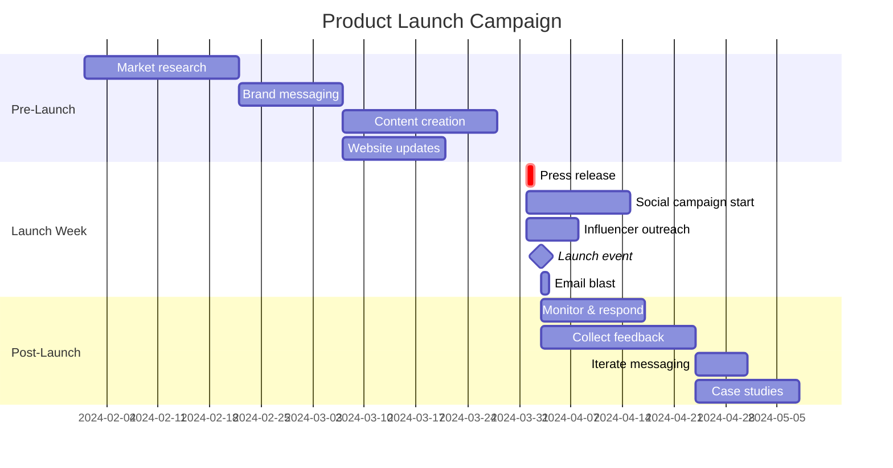

# Project Timeline Template

Ready-to-use Gantt charts for project planning and tracking.

## Basic Project Timeline



## Software Release Plan



## Sprint Planning

```mermaid
gantt
    accTitle: Sprint 15 Planning
    accDescr: Two-week sprint with task assignments, tech debt items, testing, and sprint review milestone.
    title Sprint 15 (Jan 15 - Jan 29)
    dateFormat YYYY-MM-DD
    axisFormat %a %d

    section Sprint Tasks
    TASK-201: Login redesign      :done, task201, 2024-01-15, 2d
    TASK-202: Dashboard widgets   :active, task202, after task201, 3d
    TASK-203: Export feature      :task203, after task202, 2d
    TASK-204: Notification system :task204, 2024-01-17, 4d

    section Tech Debt
    Refactor auth module        :crit, td1, 2024-01-15, 3d
    Update dependencies         :td2, after td1, 1d

    section Testing
    Write unit tests            :test1, after task202, 2d
    Integration tests           :test2, after task203, 2d

    section Milestones
    Sprint Review               :milestone, review, 2024-01-29, 0d
```

## Product Roadmap



## Marketing Campaign



## Usage Instructions

1. Copy the relevant template
2. Update `title` with your project name
3. Adjust `dateFormat` if needed (common: `YYYY-MM-DD`)
4. Update section names and tasks
5. Set task dates and durations
6. Add dependencies with `after taskId`
7. Include `accTitle` and `accDescr` for accessibility
8. Test in [Mermaid Live Editor](https://mermaid.live/)

## Task Status

| Status | Syntax | Appearance |
|--------|--------|------------|
| Normal | `:taskId, date, duration` | Default bar |
| Done | `:done, taskId, date, duration` | Filled/completed |
| Active | `:active, taskId, date, duration` | Highlighted |
| Critical | `:crit, taskId, date, duration` | Red/urgent |
| Milestone | `:milestone, taskId, date, 0d` | Diamond marker |

## Date Formats

| Format | Example | Use |
|--------|---------|-----|
| `YYYY-MM-DD` | 2024-01-15 | Standard (default) |
| `axisFormat %b` | Jan, Feb | Monthly roadmaps |
| `axisFormat %a %d` | Mon 15 | Sprint-level detail |
| `axisFormat %d/%m` | 15/01 | European format |

## Tips

- Gantt charts do NOT support theme init blocks — styling is automatic
- Use `excludes weekends` to skip Sat/Sun
- Use `after taskId` for dependencies
- Use `axisFormat` to customize date display
- Keep task names short and descriptive
- Group related tasks in sections
