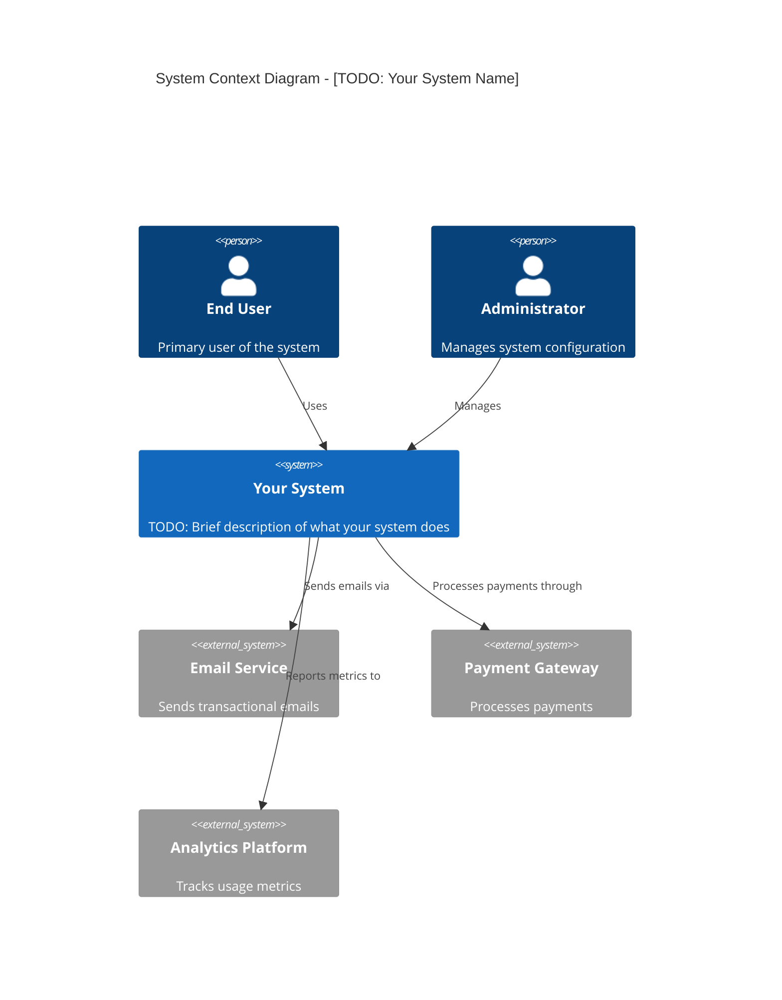
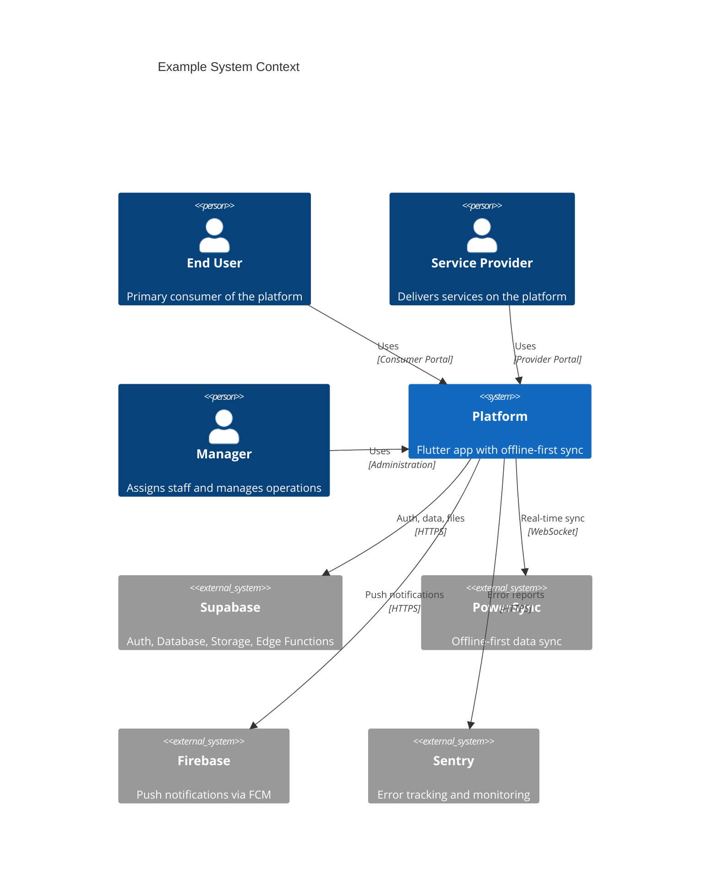
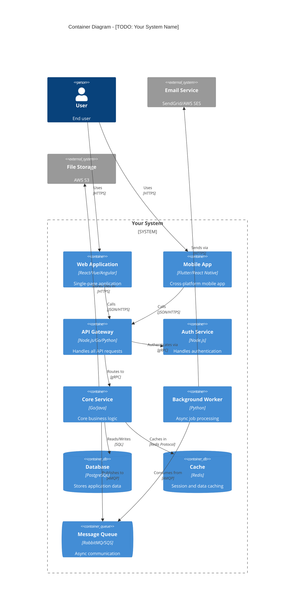
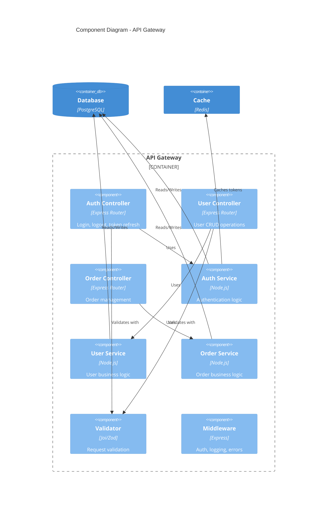

# Software Architecture Template

Ready-to-use C4 diagrams for documenting software architecture.

## System Context Diagram

High-level view of your system and its environment.

## Example System Context

## Container Diagram

Zoom into your system to show the high-level technology decisions.

## Component Diagram

Zoom into a specific container to show its internal structure.

## Usage Instructions

1. Copy the relevant diagram template above
2. Replace all `TODO:` comments with your actual system details
3. Adjust container names, technologies, and relationships
4. Remove unused components
5. Include `accTitle` and `accDescr` for accessibility
6. Test in [Mermaid Live Editor](https://mermaid.live/)

## C4 Element Reference

| Element | Syntax | Use |
|---------|--------|-----|
| Person | `Person(id, "Name", "Desc")` | Users/actors |
| System | `System(id, "Name", "Desc")` | Your system |
| External | `System_Ext(id, "Name", "Desc")` | External systems |
| Container | `Container(id, "Name", "Tech", "Desc")` | Applications |
| Database | `ContainerDb(id, "Name", "Tech", "Desc")` | Data stores |
| Queue | `ContainerQueue(id, "Name", "Tech", "Desc")` | Message queues |
| Component | `Component(id, "Name", "Tech", "Desc")` | Code modules |
| Boundary | `System_Boundary(id, "Name") { }` | System grouping |
| Relationship | `Rel(from, to, "Label", "Tech")` | Connections |

## Customization Tips

- C4 diagrams do NOT support theme init blocks — they use built-in C4 styling
- Use `System_Boundary()` for grouping related containers
- Use `Container_Boundary()` for grouping components within a container
- Add technology labels to relationships for protocol clarity
- Keep descriptions concise — they render as subtitle text
