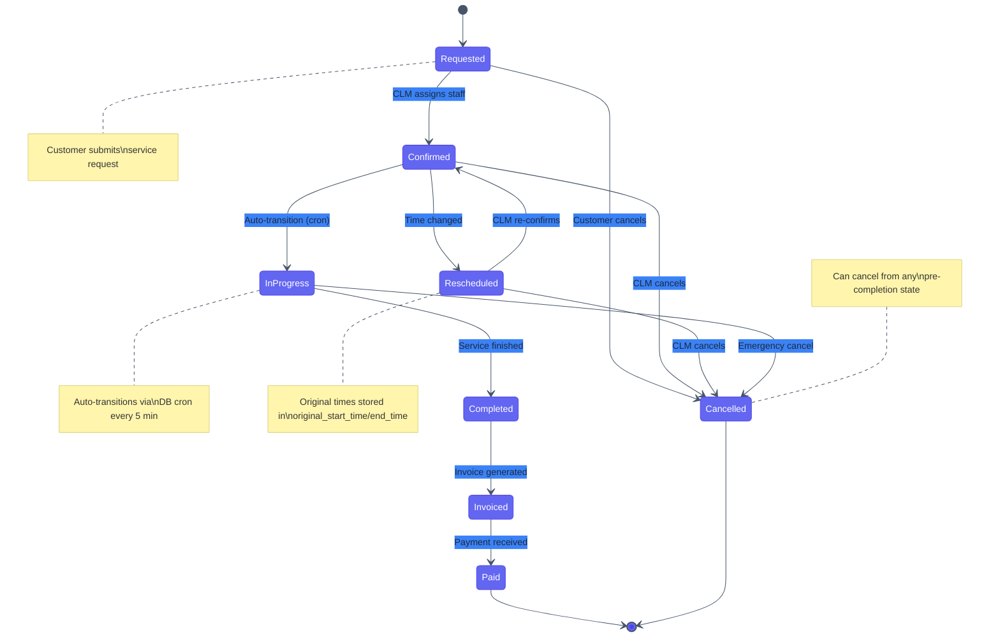
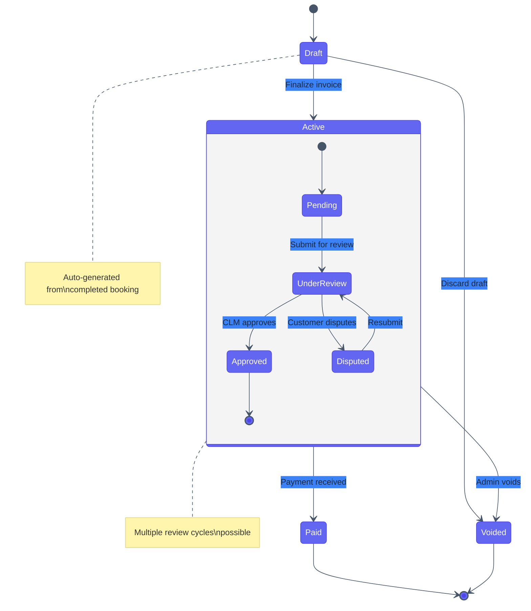
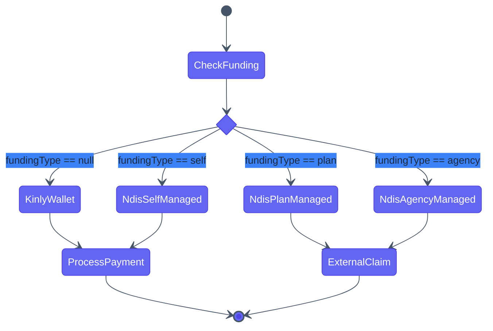
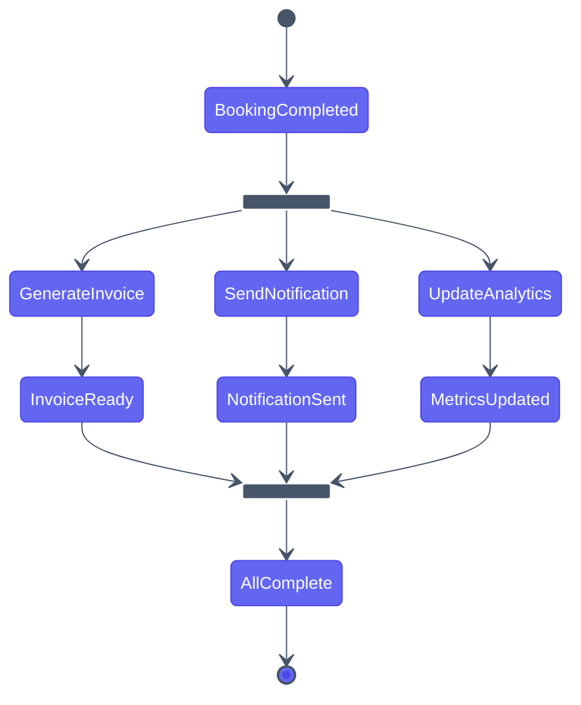
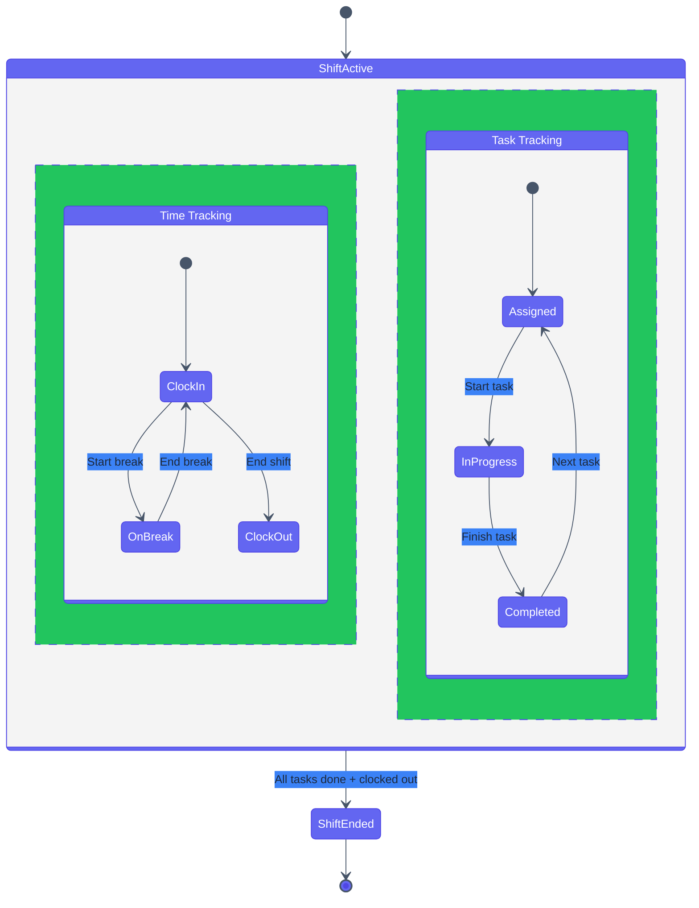

# State Lifecycle Template

Ready-to-use state diagrams for documenting entity lifecycles and state machines.

## Entity Lifecycle (Booking Example)

## Nested Composite States

## Choice Nodes (Conditional Routing)

## Fork/Join (Parallel Transitions)

## Concurrent Regions

## Usage Instructions

1. Copy the relevant lifecycle template
2. Rename states to match your entity
3. Add/remove transitions as needed
4. Include `note` annotations for important business rules
5. Test in [Mermaid Live Editor](https://mermaid.live/)

## State Diagram Syntax Reference

| Feature | Syntax | Example |
|---------|--------|---------|
| State | `StateName` | `Requested` |
| Transition | `A --> B : label` | `Draft --> Active : Submit` |
| Start | `[*] --> A` | `[*] --> Draft` |
| End | `A --> [*]` | `Paid --> [*]` |
| Note | `note right of A : text` | `note right of Draft : Auto-created` |
| Nested | `state Parent { ... }` | See composite example |
| Choice | `state name <<choice>>` | See choice example |
| Fork | `state name <<fork>>` | See fork example |
| Join | `state name <<join>>` | See join example |
| Concurrent | `--` inside state | See concurrent example |

## Tips

- Every state diagram MUST show failure/cancellation transitions (per style guide)
- Use `\n` for multi-line notes
- Nest states to reduce visual complexity for large lifecycles
- Use choice nodes instead of complex diamond flowcharts for conditional routing
- Fork/join is ideal for showing parallel async operations
