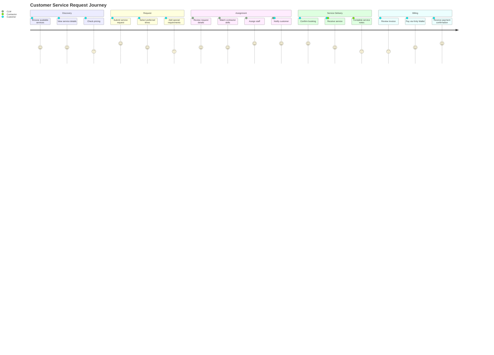
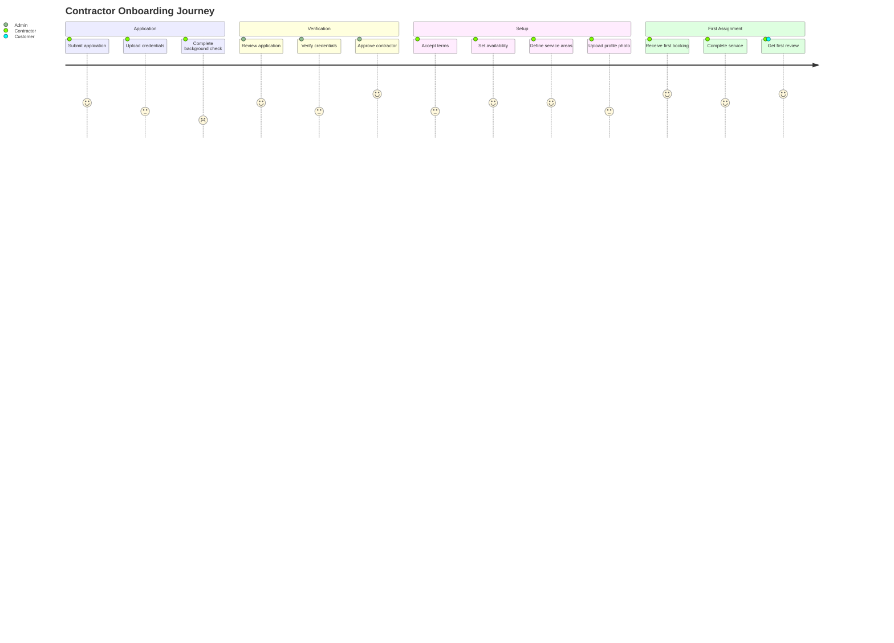
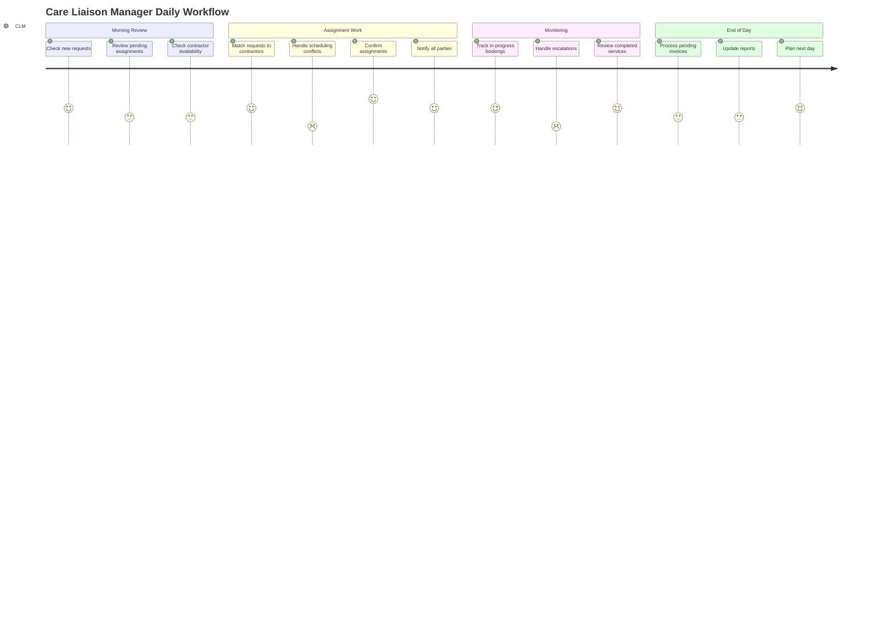
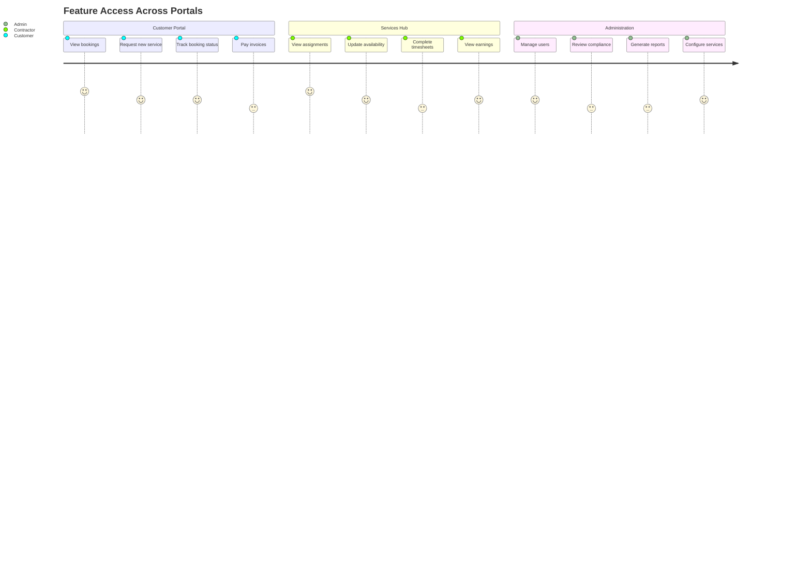

# User Journey Template

Ready-to-use journey diagrams for documenting user experiences and satisfaction scoring.

## Customer Service Request Journey

## Contractor Onboarding Journey

## CLM Daily Workflow Journey

## Multi-Portal Feature Access Journey

## Usage Instructions

1. Copy the relevant journey template
2. Update the title to describe the journey
3. Modify sections to match your user flow stages
4. Update tasks with appropriate satisfaction scores (1-5)
5. Assign actors to each task
6. Test in [Mermaid Live Editor](https://mermaid.live/)

## Journey Syntax Reference

| Feature | Syntax | Example |
|---------|--------|---------|
| Title | `title Text` | `title Customer Journey` |
| Section | `section Name` | `section Onboarding` |
| Task | `Task name: score: actors` | `Sign up: 5: Customer` |
| Multiple actors | `Task: score: A, B` | `Meet: 4: CLM, Customer` |

## Satisfaction Scoring Guide

| Score | Meaning | Use When |
|-------|---------|----------|
| 1 | Very frustrated | Pain point, major blocker |
| 2 | Frustrated | Difficult step, high friction |
| 3 | Neutral | Acceptable but not great |
| 4 | Satisfied | Good experience, minor friction |
| 5 | Delighted | Excellent, seamless experience |

## Tips

- Journey diagrams do NOT support theme init blocks or classDef styling
- Focus on emotional experience, not technical steps
- Use scores to highlight pain points (1-2) that need improvement
- Group related steps into meaningful sections
- Include all relevant actors for each step
- Keep task names short (they render as labels on the chart)
